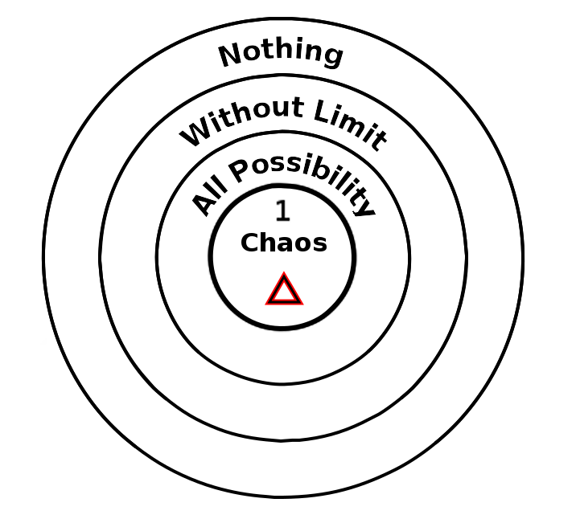

ifdef::env-github,backend-html5[]
link:00-Intro.adoc[< Prev - Introduction <]
endif::[]

## A Beginning

[quote,The Mass of the Dead God]
____
In the beginning the world was without form and void,
and darkness was upon the face of the deep,
and Chaos moved upon the face of the waters.
____

// "Nothing is unstable," Frank Wilczek.
// https://asunow.asu.edu/20170208-finding-nothing-conversation-frank-wilczek

// https://tierneylab.blogs.nytimes.com/2009/06/12/the-physics-of-nothing/

// This question seems to be linked to Heidegger's Introduction to Metaphysics,
// which is unfortunately linked to Nazism :(

The fundamental question of metaphysics, why is there anything at all? or put another way, why not nothing?
This is where we begin with this theory of magick.footnote:[We choose to use the spelling "magick" in the tradition of Aliester Crowley to differentiate from works of illusion.]

Our response to this question asserts that core to the answer is the paradox it implies.
Many explanations of existence are mere shell games.
If we suggest there is a creator or creative force that does the creation, then where does this come from?
Our theory of existence must also match to the data we have about existence, that it is subjective and that it occurs in time.
// http://www.scholarpedia.org/article/Hard_problem_of_consciousness
Our theory of existence must address the "Hard Problem" of consciousness, expressing not just why there is existence but why it is experienced subjectively.
This is a challenge that so far physical theories, theories that put objectivity first, have not sufficiently addressed, instead dodging the question or claiming subjectivity is somehow irrelevant, uninteresting, or a sort of psychological fraud.
// FIXME - cite churland, dennett etc...

This chapter will take us on the first step towards building this theory.
The key feature to keep in mind is that these steps paint an evolution of existence.
It is not until the full process has been laid out that one can entirely look back and see the ground that has been covered.

The outline of this process is undeniably influnced by a passing familiarity with hemetic Qabalah.
Up to the tenth step of creation the parallels to qabalistic systems will be obvious, but this process should be understood as a reinterpretation of Qabalah.
ANQ is an alternative system.
No time will be spent speculating if ANQ proposes any sort of "correct" interpretation of anything.
No reference will be made to traditional texts or understandings of Qabalah.
The ANQ system is complete unto itself without making these connections.
Indeed, trying to map these associations is more likely to confuse that elucidate.

Author C. Clarke wrote, "Any sufficiently advanced technology is indistinguishable from magic."
This may be true, but we aim to root our magick in a deeper place.

, rooted in the same mystery as consciousness and free will, or simply Will.

These are philisophically fraught topics, and this book is not a work of philisophical writing.
Still, we will attempt to give an outline of a philosophy and responses to philosophical challenges.

// Should I use the word "consciousness"
//  consciousness
//  awareness
//  perception
//  attention
//  kia

To put it too simply, consciousness is what occurs when the spotlight of perception is shined upon a void of determinate being.
Will is that act of manfesting from consciousness.
Magick is any act of Will.
The word "magick" is often reserved to reference manifesting which occurs outside of normal embodied action, but this is a mistake because often the most powerful vector of magickal manifestation is embodied action.

// https://www.sacred-texts.com/oto/aba/defs.htm
Aliester Crowley wrote, "Magick is the Science and Art of causing Change to occur in conformity with Will."
On this point we agree, but Crowley also has much to say regarding a "True Will" which we regard as a particular magickal formula rather than a fundamental truth to the nature of magick.
We also wish to distinguish actions that arise from consciousness from those that occur without consiousness.

There is also a notion of Will that everything is imbued with a sort of consciousness and everything acts with Will.
The Will of a stone that falls to Earth has a Will to fall.
While this is a valid notion of consciousness and Will, it is not of much use to one that wishes to practice Magick.
The particular interest of the magickian is to engage the body and brain, which implement the mind, to work one's magick.
So we will reserve the concepts of Will and Consciousness to application to perceptual organisms such as we are.

Consciousness...

Aside about Unconscious/Sub-Conscious

Free Will...

Magick...

Nobel Laureate Frank Wilczek is credited with the aphorism that "nothing is unstable."

### Negative Existence

Existence happens because non-existence is unstable.

The nature of non-existence can be understood in three steps.
Nothingness means no-thing-ness.
“No”, negation, is the key to understanding.
The nature of Nothing can only be approached by stripping away all concept of what it is.
Nothing is not anything, nor is it void, nor is it not void.
Following this spiral of negation we approach an understanding that nothing is in no way limited.
The nature of pure non-being is identical with all being, even all contradiction, asserting itself into being simultaneously.

### Primal Chaos

The principle of the instability of non-being is primal Chaos.
This is the divine spark of creation, the light that flashes out of void and defines the void in its light.
Its spark may immediately flash and go out, or it may take such a form that it gives rise to the next step.

ifdef::env-github,backend-html5[]
link:02-Process.adoc[> Next - Process >]
endif::[]
