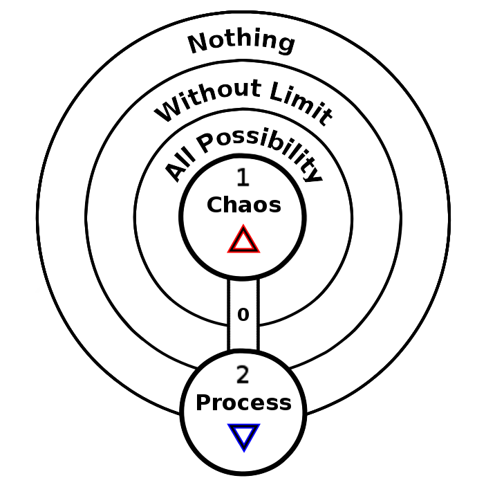

ifdef::env-github,backend-html5[]
link:01-Beginning.adoc[< Prev - A Beginning <]
endif::[]

== Process

If what is asserted into being by Chaos is incomplete then it leaves a gap for further creation to follow on.
What is created is not a statement, but a question begging for an answer.
All creation as we experience it is essentially incomplete, this is the first part of the flow of time.
A chain of creation can now manifest, a process of incompleteness following incompleteness.
This flow is the divine principle of water.

In this step the emergent tree shows us its mode of budding, one sphere gives rise to a second sphere.
The first path also emerges here.
This is the path of the fool and the nature of the fool is evident in this process of endlessly moving forward into the unknown.

=== Incompleteness

=== Absurdism

=== Syzygy

ifdef::env-github,backend-html5[]
link:03-Pattern.adoc[> Next - Pattern >]
endif::[]
