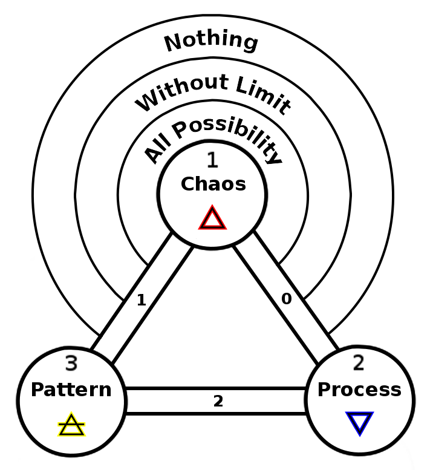

ifdef::env-github,backend-html5[]
link:02-Process.adoc[< Prev - Process <]
endif::[]

== Pattern

The continuation of the process gives rise to a pattern.
The run of the process can be collected in its entirety in the statement of the pattern it produces.
In a simple sequence of 1 + 1 + 1 + 1 + … we can simply assert the number the process has reached.
This is the divine principle of air, the result of the interaction of divine fire and water.

This step shows us the second mode of emergence, splitting.
Both the sphere and its path is split.
These are numbered sequentially with split paths numed first.

=== Tessalations

=== Thesis, Antithesis, Synthesis

=== Paradims and Paradigm Shifting

ifdef::env-github,backend-html5[]
link:04-Emergence.adoc[> Next - Emergence >]
endif::[]
