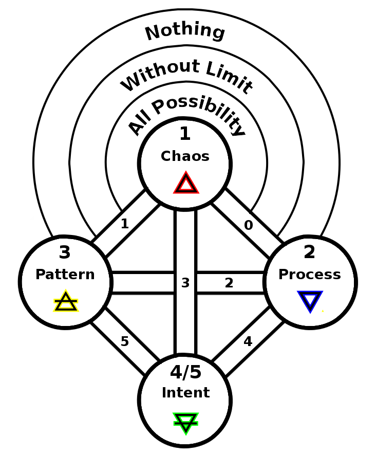

ifdef::env-github,backend-html5[]
link:03-Pattern.adoc[< Prev - Pattern <]
endif::[]

## Emergence

Within the complexity of Pattern arise emergent phenomena.
The game of chess lays out only the rules by which the pieces move and how the game is won, it does not dictate a strategy, and yet some moves are proven better than others.
See also Conway’s Game of Life.
This manifestation is the principle of earth.

Note that we orient a compass with North down and East to the left, we find this is the classic orientation of the elements used in many rituals such as the Lesser Ritual of the Pentagram.
Elements with opposing complementary aspects are across from each other on central paths.

This is now creation within creation, we move into the next level of the tree.
The fourth sphere has budded from the first.
It is numbered first by counting number and then by sequence of prime number.
A new rule is also established here.
The numbering of the paths will not exceed the sequence of the corresponding prime number of the sphere.

We also see here the first interesting numerical pattern, a symmetry of paths that all add to 5: 0+5, 1+4, 2+3.
This is the first of many such patterns.

ifdef::env-github,backend-html5[]
link:05-Descent-of-Fire.adoc[> Next - Descent of Fire >]
endif::[]
