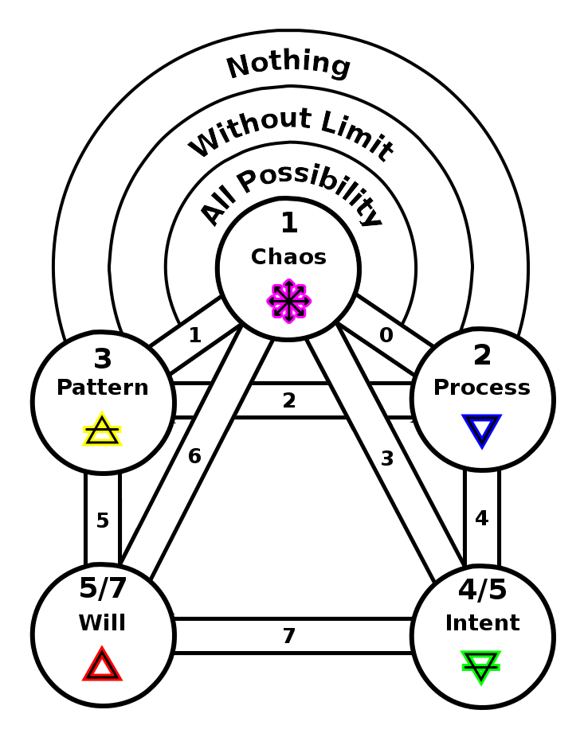
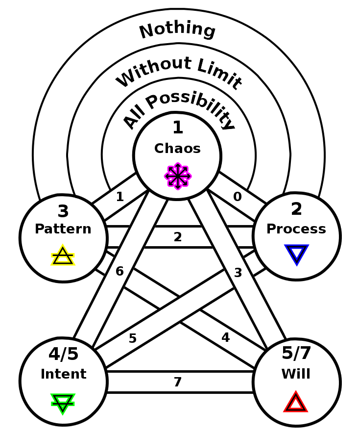
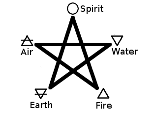
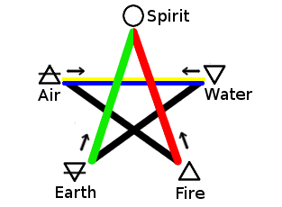
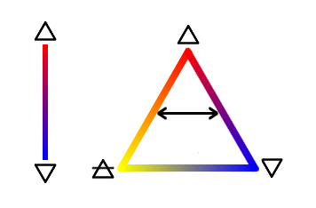
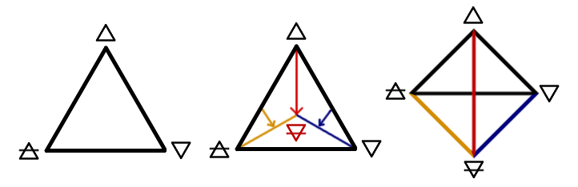
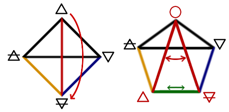
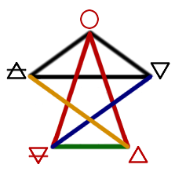

ifdef::env-github,backend-html5[]
link:04-Emergence.adoc[< Prev - Emergence <]
endif::[]

## Descent of Fire

So far the process of manifestation describes only abstract static concepts.
Because the emergence of intent in the previous step exists within a larger pattern there is now the possibility for these intents to be in conflict.
These things can be created and destroyed.

Think of a game like chess.
First, the game consists of a set of rules, the pattern which constrains the game.
Within the game the board starts a pre-determined configuration, with each piece able to move upon the board and take other pieces.
The pieces of the game are clearly individual units that can be destroyed or removed depending on how the game proceeds.
The removal of a piece does not break the game, it is part of the game.
It is this principle, that things can change, creating and destroying that is the next principle.

In the fifth step there is also an echo of the second.
We return to process, returning to incompleteness, but in the second step the process is always building, it is now at the next level and can be destructive at this level.

If the process of creation will now continue in this level, creation must necessitate destruction.
This is simply the same process as before, chaos sparking creation into the world, but now it is disruptive to what was there previously.
This is the fundamental nature of the force of Will, though it has not yet attached itself to an agent.

This fifth sphere emerges by splitting from fourth.
The path marked “6″ splits from “3″ along with it.
A new symmetry of sums appears: 9 = 6+3 = 2+7 = 4+5.

If we twist the bottom of the fifth step of the process tree we find it corresponds to the classic elemental configuration of the pentagram:

### Reinterpreting the Elemental Pentagram

The pentagram is just a five pointed star.
If it appears in a circle then it can be called a pentacle.
It can be aligned with a central point upward or downward or to the side, whatever suits.
Fundamentally the pentagram is just a beautiful geometric shape to which meanings can be associated.

There is a traditional set of pentagrams that map the four elements of fire, water, air, and earth to the four lower points and spirit to the topmost point.

Little explanation is given to explain why these elements are assigned these positions.
One popular explanation is that these follow a clockwise rotation about the center of the pentagram following the order of the elements: Spirt > Fire > Air > Water > Earth.
This corresponds to “weights” of the elements in that Spirit is the most subtle, heat/fire rises in air, water falls in air, and earth sinks in water.

If this is the principle for the pentagram’s construction, then we might guess that invoking/banishing pentagrams could correspond to traversing the pentagram clockwise/anticlockwise starting and returning to the element invoked or banished.
So banishing earth would originate at the Earth point and start by moving up to Water while invoking earth would start at Earth and move up to Spirit.
This is a perfectly workable system, but it is not the traditional system.

The traditional system is quite surprising in many regards and suggests that the explanation for the elemental positions is not as normally described.
Shown below are the traditional associations of elemental pentagrams for banishing.

The invoking pentagrams use the same line segments as the banishing pentagrams, only reversed.
So banishing Earth starts in the point assigned to Earth and moves up to Spirit while the invoking Earth pentagram starts in Spirit and descends to Earth along the same line.
What is more, the Air and Water pentagrams stand in an opposing relationship where Banishing Air is the exact same pentagram as invoking Water.
Finally, and perhaps most surprising, is that two paths are left for spirit pentagrams and neither of these start or end on the spirit point.
The path originating in Earth is termed Spirit Passive while the path originating in Fire is Spirit Active.

These pentagrams have horizontal symmetry that does not suggest a circular motion or interpretation.
Air and Water stand in an opposite relationship and Earth and Fire stand in another sort of opposite relationship.
Spirit seems to have an opposite relationship to itself!

A possible explanation for this configuration can be found hidden in the best known pentagram ritual, the Lesser Banishing Ritual of the Pentagram.
In this ritual we find the elements corresponding to the compass directions with Air in the East, Fire in the South, Water in the West, and Earth in the North:

image::media/???.png[Elemental Compass]

Here we find Air/Water in opposite quarters.
Air associated with the intellect and water with the emotional.
Fire is positioned as energy and change while North is the created, the actual.
In order to transform this compass layout into the pentagram above, fire needs to descend to the Earth.
This is the transformation from the divine creative fire to fire taking on its destructive characteristics.
Earth is destroyed and takes on characteristics of death.
This transformation is visualized as an impulse running down the path from Fire to Earth.
The path is split and leaves an empty void in the upper location which is the position of Spirit.

This explains the elemental pentagrams.
Air and Water stand as balanced opposites and so their paths are symmetrical for invoking/banishing.
Fire and Earth stand in the same relationship, but because of the fall of fire they bear this relationship through Spirit, not directly to each other.

This explanation so far tells us only about these three paths of the pentagram.
The paths of spirit haven’t been addressed yet.
To explain their origin we need to go back farther and reveal paths that were not shown previously.

Originally there is the divine fire, pure chaotic creation without bounds.
The divine fire finds its pair when it creates that which can receive and guide a further process of creation.
This is the fundamental nature of water.
As creation of the divine fire flows through the process of water it creates a pattern that is the process taken as an integrated unity.
This integrative and unifying property is the fundamental nature of Air.

The next step is within the pattern there arises a new creation.
This is emergence.
It is the power of process and pattern to give rise to novel creations that display natures beyond what was originally put in.
This is the fundamental property of Earth.

This yields the compass configuration of the elements discussed previously.
Now we see that there are paths that around the outside of the figure as well.
These will form the spirit paths of the pentagram.

Showing the process of division discussed previously, now with the additional paths, suggests the splitting of Earth after the descent of fire produces not a pentagram but a pyramid.

The familiar pentagram is a variation on this same picture, simply with a twist at the bottom.

The paths in blue and yellow are the paths employed in the spirit pentagrams passive and active.
The path shown in green, connecting fire and earth, is the path representing the fall of fire.
It is the union of the active and passive aspects of spirit.

When invoking spirit it is best to invoke both passive and active.
First invoke passive, starting in earth and up towards water and around to Air, Fire, Spirit and back to Earth.
Now draw the path from Earth to Fire and invoke spirit active through Air, Water, Earth, Spirit and back to Fire.
The result should be that this allows for a union of Fire and Earth, a reversal of the fall and allowing spirit to become the divine fire once again.

### ANQ Pentagram Ritual

The ANQ pentagram ritual follows in a pattern established by the Lesser Ritual of the Pentagram, LRP, also known as the Lesser _Banishing_ Ritual of the Pentagram, LBRP,
but with the simplifications used in Peter Carrol's Gnostic Pentagram ritual.

The direct pentagram invoking and banishing patterns are understood as a result of the emergence of the position of the five elements from the four through the descent of fire discussed previously.

In brief, Water and Air make a syzygy, a complementary/opposite pair: process and pattern, the process being the essential incompleteness of existence that yields the flow of creation and its complement of the universal pattern produced by the flow of process.
Fire and Earth are also a syzygy.
Fire originally being the divine spark of chaos which asserts itself into being from non-being and Earth being the emergent phenomena which arises within process and pattern, Intent.
In the fifth step fire has descended and now its creative force is also destructive.
The creation/destruction of Fire is Will.
Divine reasonless-ness of chaos is spirit and creation/destruction is fire.
The path between the top point and fire and earth still represents the syzygy, even though it is now split.

When invoking the path should be drawn with a total of six strokes.
Begin as indicated below, moving along the path toward the element, tracing out the pentagram and ending by repeating the first path to end on element invoked.
In banishing we use five strokes, we reverse the initial direction and stop upon returning to the element, returning it to its proper place.
Banishing is balanced, the fifth stroke brings completion. Invoking is intentionally not balanced.

ifdef::env-github,backend-html5[]
link:06-Agency.adoc[> Next - Agency >]
endif::[]
