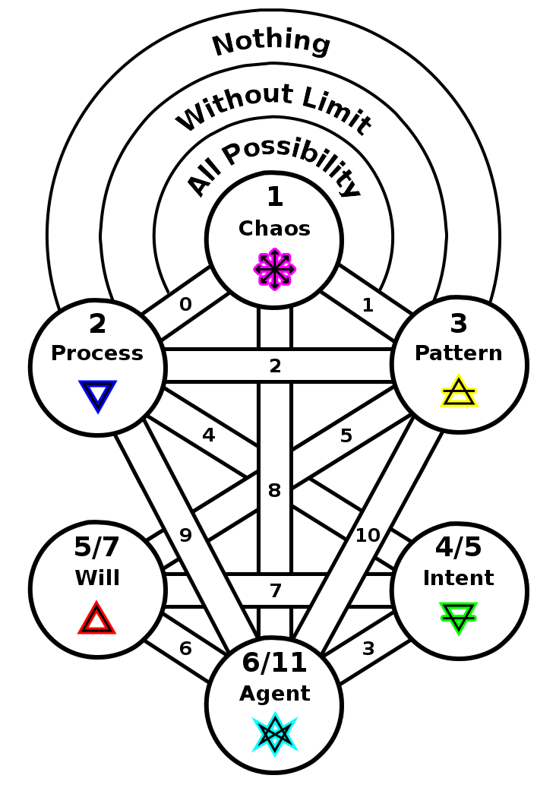

ifdef::env-github,backend-html5[]
link:05-Descent-of-Fire.adoc[< Prev - Descent of Fire <]
endif::[]

== Agency

In the next step of creation the emerging tree provides a process for the flow from chaos to act within being.
As the numbering of the paths may not exceed the next prime number, 11, we see that paths “3″ and “6″ follow the budding of the sixth sphere.

image::media/6-tree-straight.png[Sixth Tree, Straight]

If we again twist the configuration of the tree by swapping the positions of spheres 2 and 3 we obtain an elemental formulation for the averse pentagram:

=== The number 6

2 * 3; 4 + 2; 5 + 1

=== Blind Mechanism of Agency

=== Averse Pentagrams

=== Lenormand 36 card deck

=== Hexagrams

ifdef::env-github,backend-html5[]
link:07-Perception.adoc[> Next - Perception >]
endif::[]
