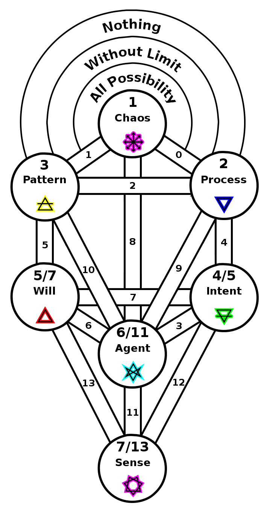
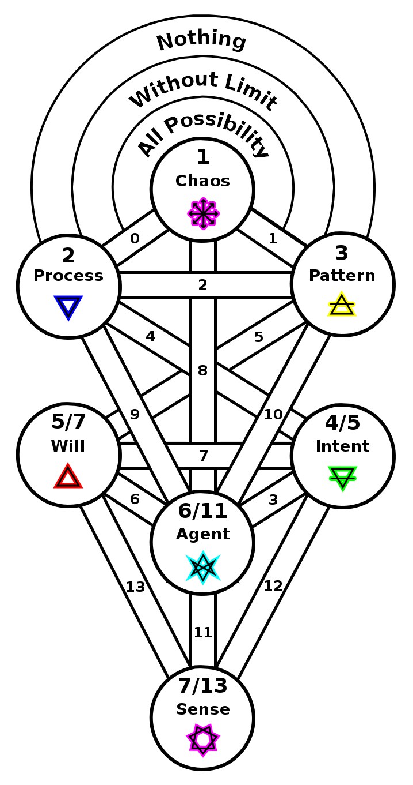

ifdef::env-github,backend-html5[]
link:06-Agency.adoc[< Prev - Agency <]
endif::[]

## Perception

The agent, if not complete unto itself, leaves a gap where again further manifestation may appear.
This is now experienced by the agent.
Perception is the continuing process creation manifesting.
This perception is both raw sense as well as emotional reaction.

ifdef::env-github,backend-html5[]
link:08-Representation.adoc[> Next - Representation >]
endif::[]
