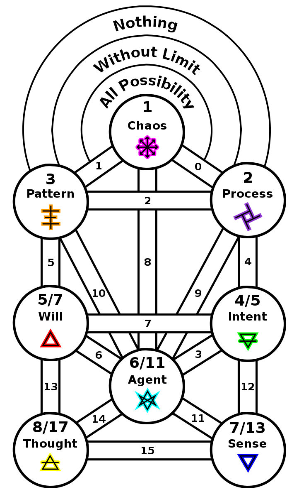
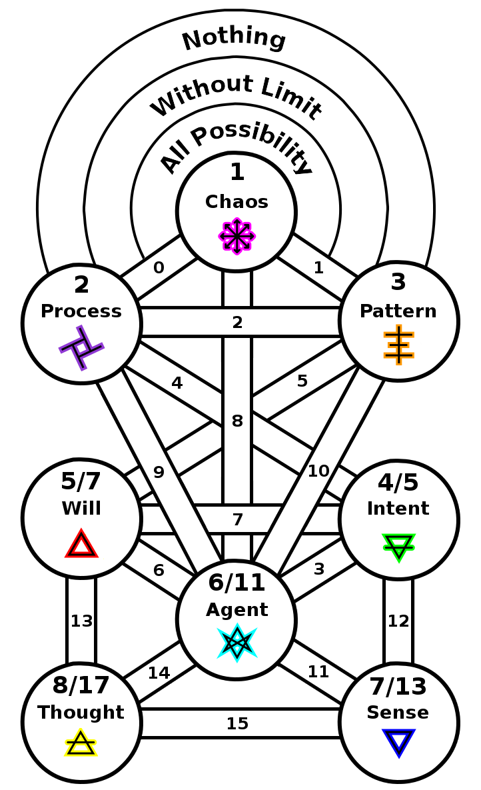

ifdef::env-github,backend-html5[]
link:07-Perception.adoc[< Prev - Perception <]
endif::[]

## Representation

The counterpart to sense is memory as the counterpart.
From sensation there is now internal representation, a map-making mind.

There is a shifting of the elemental association at this point.
Water in many workings is to do with feeling and emotion while air stands for thought.
The symbols of The Process and the Psychick Cross suit for the spheres above.

As this sphere splits its prime is 17.
The path numbering trails by two, but the number 17 manifests in many symmetrical path sums: 15 + 2, 14 + 3, 11 + 6, 12 + 5, 13 + 4.
Perhaps even the pairs of 7+10 and 8+9 should be admitted.

ifdef::env-github,backend-html5[]
link:09-Desire.adoc[> Next - Desire >]
endif::[]
