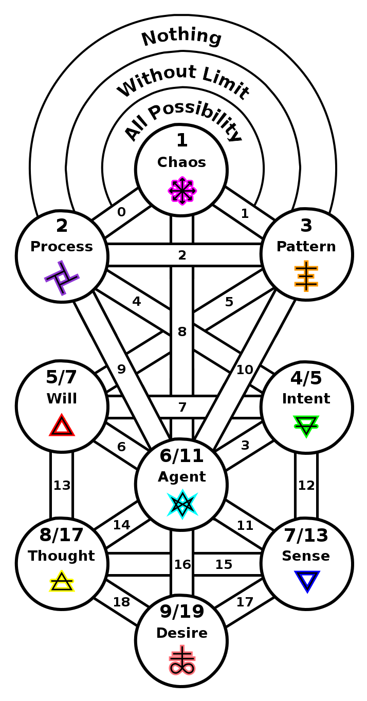

ifdef::env-github,backend-html5[]
link:08-Representation.adoc[< Prev - Representation <]
endif::[]

## Desire

The world is made manifest by desire.
Desire is a product of thought, where a memory or mere concept can drive behavior.
It is yearning for the ten thousand things and it is desire which continues the flow of creation to the manifestation of the world.

ifdef::env-github,backend-html5[]
link:10-Manifestation.adoc[> Next - Manifestation >]
endif::[]
