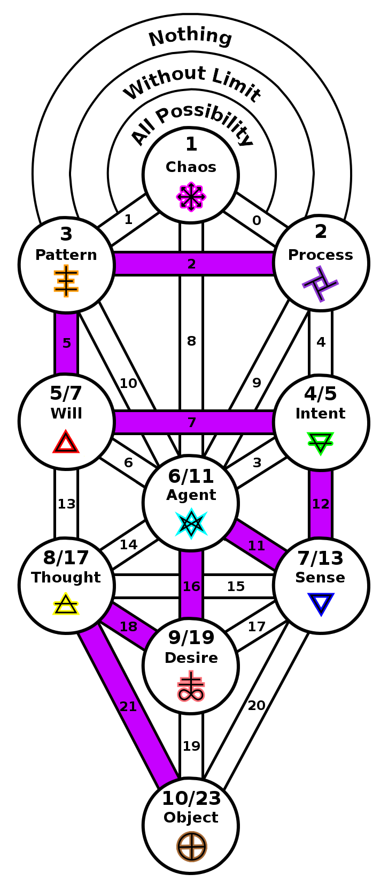
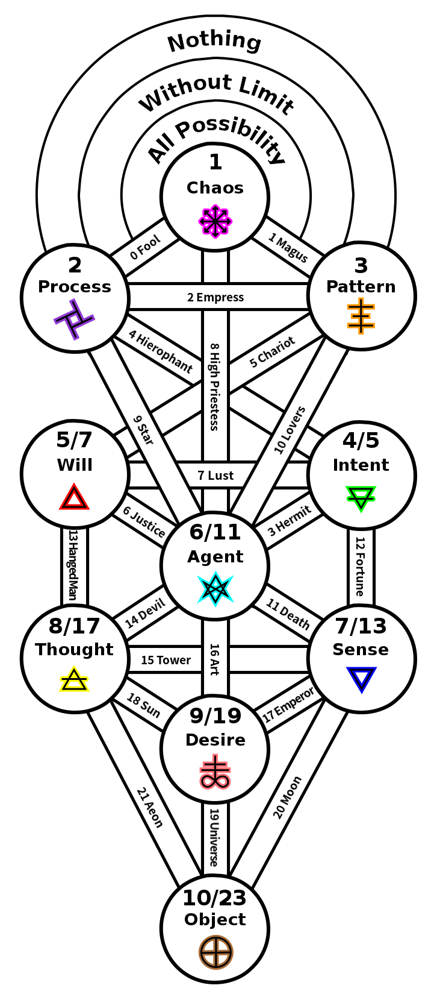

ifdef::env-github,backend-html5[]
link:09-Desire.adoc[< Prev - Desire <]
endif::[]

## Manifestation

Through desire the world is made manifest.
This is a basic formula of magick, desire must be manipulated, lust of result eliminated, in order to have power to manifest results.

In the sequence of primes, 23 emerges into manifest reality.
The number 23 also manifests in another intriguing way.
One of the numerical patterns that appears in the tree is the wandering sum.
These are consecutive expanding chains of path numbers that add up to the same value.
23 = 11+12 = 16 + 7 = 18 + 5 = 21 + 2.

In this step we now have a tree that resembles the traditional tree in Qabalah.
This was not the goal of this work.
Consistent attempts were made to manifest this tree into a different form with different path structure, but the mathematical patterns forced this structure as the most stable.
We cannot help but wonder whether these patterns of primes were not a secret of the original design.

ifdef::env-github,backend-html5[]
link:11-Breaking-the-World.adoc[> Next - Breaking the World >]
endif::[]
