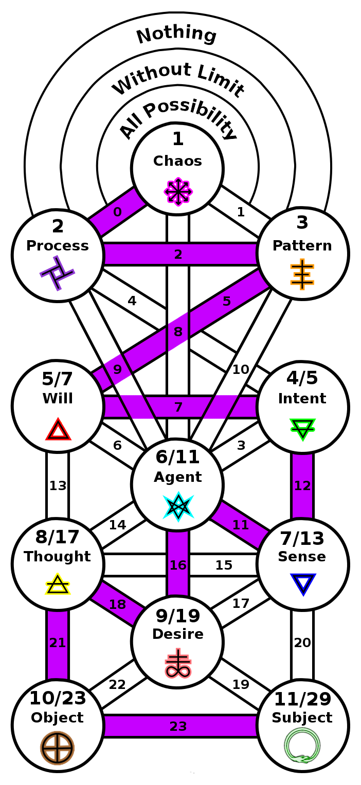

ifdef::env-github,backend-html5[]
link:10-Manifestation.adoc[< Prev - Manifestation <]
endif::[]

## Breaking the World

Presented here with the top spheres twisted, we now move beyond traditional Qabalah, breaking the tenth vessel and revealing the eleventh.
This is manifest subjectivity.
It’s emergence can be connected to the dawning of the new aeon.
It manifests in the philosophy and science from existentialism to the role of the observer in quantum mechanics.
It is the self that is made manifest in mindfulness meditation.

The state of being represented in the eleventh sphere is one that is not uncommon, but is difficult for the unpracticed to maintain.
The chaotic energy of manifestation has difficulty making it this far down the tree.
Working at higher levels on the tree can clear channels to move more energy down more consistently.
The goal is not retreat from manifestation, but rather complete manifestation in the world and beyond it.

With the manifestation of the subject, the wandering sum 23 now completes its ascent and descent.

ifdef::env-github,backend-html5[]
link:12-That-Which-Remains.adoc[> Next - That Which Remains >]
endif::[]
