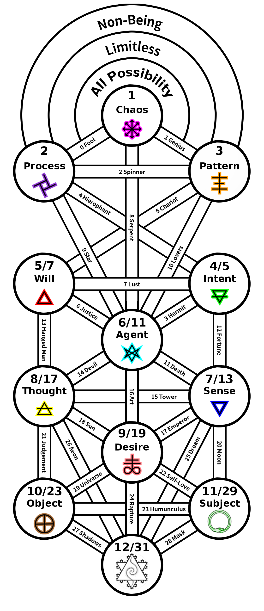

ifdef::env-github,backend-html5[]
link:11-Breaking-the-World.adoc[< Prev - Breaking the World <]
endif::[]

## That Which Remains

Beyond the manifestation of subject there is that which remains.
The goal is to fully manifest the subject and then transcend that as well.
This is the full manifestation of the Aeon.

This is prime 31.
Marked up the middle of the three are symmetrical path sums to 31: 24 + 7, 23 + 8, 15 + 16.
Together these sum to 93.
The form of the cross paths also evokes the image of the psychick cross.

Shown here, the twelfth emergent process tree is labeled with suggested path names, borrowing heavily from the Thoth tarot, while diverging from it primarily at the bottom of the tree.
Such a tarot deck would consist of 93 cards: 12 * 4 = 48 numbered suit cards, 4 * 4 = 16 court cards, and 29 trumps numbered 0 to 28.
A prototype of such a deck sits beside me now.

ifdef::env-github,backend-html5[]
link:13-The-Fools-Journey.adoc[> Next - The Fool's Journey >]
endif::[]
